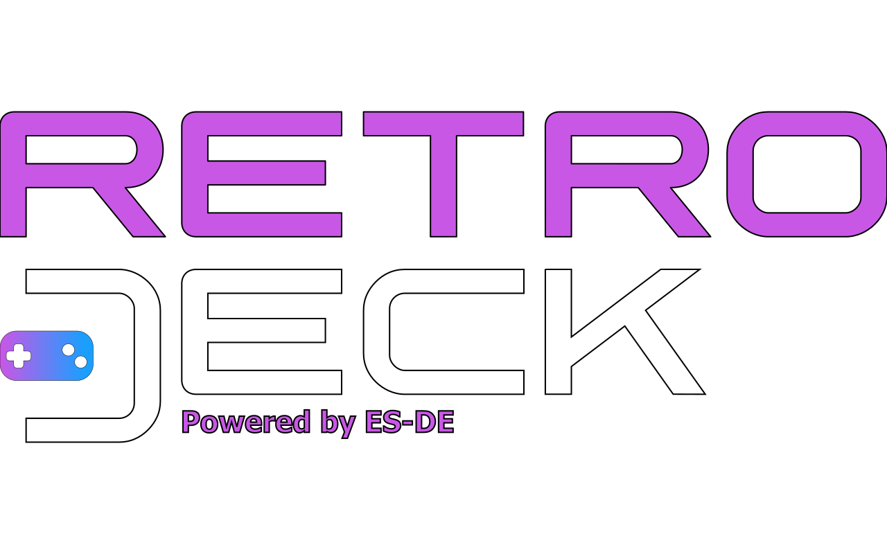

# The RetroDECK Wiki

---

## Welcome

Take a moment to explore the wiki! There’s tons of information waiting for you. To help you get started, here are a few useful links.

---

### 🚧 Wiki Update in Progress - Version 0.10.0b 🏗️

We’re currently revamping the wiki for the upcoming 0.10.0b release. Over the next few weeks we’ll be:

- Reorganizing existing pages for easier navigation 
- Adding new sections, guides, and resources
- Polishing content to reflect the latest features and improvements

While the site is under construction, some pages may move or be temporarily unavailable and might not reflect current stable. 

Thanks for your patience, exciting new content is on the way!

---

### How-to get started with RetroDECK?

- [How-to: Start using RetroDECK](wiki_general/retrodeck-start.md)

### What is RetroDECK?

RetroDECK is a powerful all-in-one retro gaming platform designed for handheld gaming PCs like the Steam Deck, full Linux desktops, Linux HTPC setups, and Linux-based PC consoles such as the Steam Machine. 

Delivered as a self-contained Flatpak app, it gives you everything you need for retro gaming right out of the box, no manual setup required. 

By integrating a wide range of components such as emulators, game engines, ports, clients and built-in tools, RetroDECK brings all your favorite games together in one streamlined, easy-to-use package.

- [What is RetroDECK?](wiki_about/what-is-retrodeck.md)
- [What is included in RetroDECK?](wiki_about/what-is-included.md)

### What devices and operating systems are supported?

- [Supported Devices & OS](wiki_general/supported-devices.md)
- [Supported Controllers / Hotkeys](wiki_rd_controls/hotkeys-retrodeck.md)

---

## Links 

### Community 

| Name                    | Description                                            |
|-------------------------|------------------------------------------------|
| [RetroDECK Blog](https://retrodeck.readthedocs.io/en/latest/blog/)   | The RetroDECK Blog |
| [RetroDECK Website](https://retrodeck.net)      | RetroDECK Wiki   |
| [Bluesky](https://bsky.app/profile/retrodeck.net) | RetroDECK Bluesky|
| [Discord](https://discord.gg/WDc5C9YWMx)    |  RetroDECK Discord Server    |
| [Matrix](https://matrix.to/#/#retrodeck:matrix.org) | RetroDECK Matrix Server |
| [Lemmy](https://lemmy.zip/c/retrodeck)         | RetroDECK Lemmy Community |
| [Stoat](https://rvlt.gg/StVaEc0w)              | RetroDECK Stoat Server |

---

### Repositories

| Name                                                                                   | Description                                           |
|----------------------------------------------------------------------------------------|-------------------------------------------------------|
| [RetroDECK/RetroDECK](https://github.com/RetroDECK/RetroDECK)                          | RetroDECK Repo: Main repo of the RetroDECK Project    |
| [RetroDECK/Cooker](https://github.com/RetroDECK/Cooker)                                | Cooker Repo: Cooker Build publication repo            |
| [RetroDECK/Wiki](https://github.com/RetroDECK/Wiki)                                    | Wiki Repo: RetroDECK mkdocs-material Wiki source code |
| [RetroDECK/RetroDECK-website](https://github.com/RetroDECK/RetroDECK-website)          | Website Repo: Retrodeck.net source code               |
| [RetroDECK/ES-DE](https://github.com/RetroDECK/ES-DE)                                  | ES-DE Repo: RetroDECK's light fork of ES-DE           |
| [RetroDECK/components](https://github.com/RetroDECK/components)                        | Components Repo: RetroDECK's central for Components   |
| [RetroDECK/RetroDECK-theme](https://github.com/RetroDECK/RetroDECK-theme)              | Theme Repo: RetroDECK's ES-DE Theme                   |
| [flathub/net.retrodeck.retrodeck](https://github.com/flathub/net.retrodeck.retrodeck)  | Flathub Repo: net.retrodeck.retrodeck                 |
| [RetroDECK/repositories](https://github.com/orgs/RetroDECK/repositories)               | Full Org Repo : All other repos in RetroDECK          |

---

### Services & Other

| Name                    | Link                                            |
|-------------------------|------------------------------------------------|
| [Github: Service](https://www.githubstatus.com/)     |  Github Service Status   |
| [RetroDECK on Flathub](https://flathub.org/apps/net.retrodeck.retrodeck)      |  RetroDECK's Flathub Page    |
| [Flathub: Service](https://status.flathub.org/)      |  Flathub Service Status    |
| [Flathub: Buildbot](https://buildbot.flathub.org/#/apps/net.retrodeck.retrodeck) | Flathub RetroDECK Builtbot |

