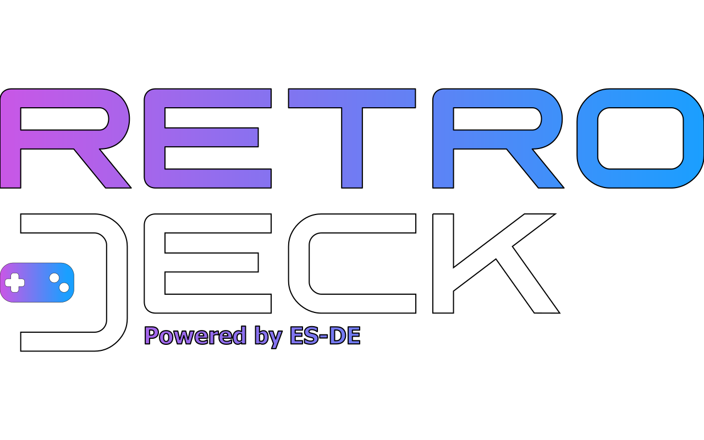



  

# **The RetroDECK Wiki**

This wiki provides clear, comprehensive documentation to help you install, configure and get the most out of **RetroDECK**.

Use the sections below to quickly find what you need or use the left-hand panel to explore the all of the content.

---

### 🚀 Getting Started

- [How-to: Start Using RetroDECK](wiki_general/retrodeck-start.md)

---

### 🧾 About RetroDECK

- [What is RetroDECK?](wiki_about/what-is-retrodeck.md)  
- [What is Included in RetroDECK?](wiki_about/what-is-included.md)

---

### 💻 Supported Hardware & Software

- [Supported Devices & Operating Systems](wiki_general/supported-devices.md)  
- [Supported Controllers & Hotkeys](wiki_rd_controls/hotkeys-retrodeck.md)

---

### 🔗 RetroDECK: Community  Links

| Category | Link | Description |
|----------|------|-------------|
| 🌐 Website | [retrodeck.net](https://retrodeck.net/) | Official RetroDECK homepage |
| 💬 Discord | [Join Discord](https://discord.gg/WDc5C9YWMx) | Discord community chat |
| 💬 Matrix | [Matrix Room](https://matrix.to/#/#retrodeck:matrix.org) | Open Matrix community space |
| 💬 Lemmy | [Lemmy Community](https://lemmy.zip/c/retrodeck) | RetroDECK community on Lemmy |
| 💬 Reddit | [r/retrodeck](https://reddit.com/r/retrodeck) | RetroDECK subreddit |
| 📖 Wiki | [RetroDECK Wiki](https://github.com/RetroDECK/RetroDECK/wiki) | Official documentation and guides |
| ❤️ Donations | [Donations & Licenses](https://retrodeck.readthedocs.io/en/latest/wiki_about/donations-licenses/) | Support the project and view license information |

---

### 📦 Repository Links

| Category | Link | Description |
|----------|------|-------------|
| 🏢 Organization | [RetroDECK Organization](https://github.com/orgs/RetroDECK) | Official GitHub organization containing all RetroDECK repositories |
| 🧩 RetroDECK Main | [RetroDECK/RetroDECK](https://github.com/RetroDECK/RetroDECK) | Main source code repository of the RetroDECK project |
| 🧩 RetroDECK Components | [RetroDECK/components](https://github.com/RetroDECK/components) | Central repository for RetroDECK components |
| 🧩 RetroDECK Cooker | [RetroDECK/Cooker](https://github.com/RetroDECK/Cooker) | Cooker publication repository |
| 🎨 ES-DE Frontend | [RetroDECK/ES-DE](https://github.com/RetroDECK/ES-DE) | RetroDECK’s lightweight fork of ES-DE |
| 🎨 ES-DE Theme | [RetroDECK/RetroDECK-theme](https://github.com/RetroDECK/RetroDECK-theme) | Official RetroDECK theme for ES-DE |
| 🌍 retrodeck.net | [RetroDECK/RetroDECK-website](https://github.com/RetroDECK/RetroDECK-website) | Source code for the official RetroDECK website |
| 🌍 Flathub Page | [RetroDECK on Flathub](https://flathub.org/apps/net.retrodeck.retrodeck) | Official RetroDECK application page on Flathub |
| 📖 RetroDECK Wiki | [RetroDECK/Wiki](https://github.com/RetroDECK/Wiki) | Source code for RetroDECK Wiki |
| 📦 Flathub Repo  | [flathub/net.retrodeck.retrodeck](https://github.com/flathub/net.retrodeck.retrodeck) | Flathub packaging repository |

---

### 🛠 Service Links

| Category | Link | Description |
|----------|------|-------------|
| 🌍 Github Status | [GitHub Status](https://www.githubstatus.com/) | GitHub platform service status |
| 🌍 Flathub Status | [Flathub Status](https://status.flathub.org/) | Flathub platform service status |
| 🤖 Flathub Buildbot Status | [Flathub Buildbot](https://buildbot.flathub.org/#/apps/net.retrodeck.retrodeck) | Live build status for net.retrodeck.retrodeck on Flathub |

---

