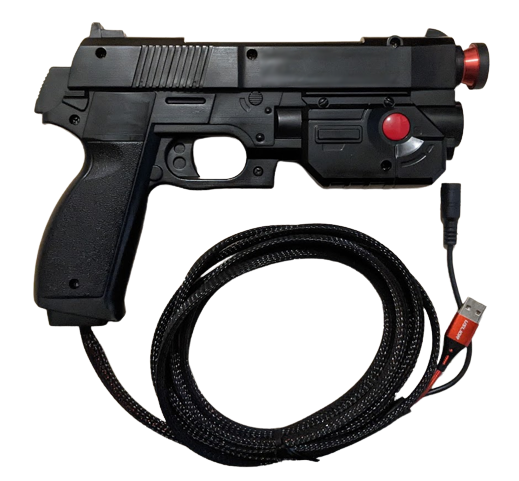

# Lightguns Controllers

Lightguns are special type of controllers use to play lightgun games is a broad category that encompasses the vast majority of first / third party controllers, DIY and open source projects.

## Sinden

[Sinden Website](https://sindenlightgun.com/)

### How to configure?

WIP

## GUN4IR

The GUN4IR uses LED point strips around your display and allows you to rebuild existing lightguns or toyguns into the GUN4IR system.  

- A configuration software with a valid license is required that be bought from the website (or come with a GUN4IR total system purchase)
- The software is as of this date Windows only, you will need to connect the Windows device to the display you want to use.
    - The calibration and firmware updates can be done in Windows on the display you want to play on.
    - After the calibrtion you can unplug the device and use it in Linux (but not RetroDECK yet).

[GUN4IR Website](https://www.gun4ir.com/)

### How to configure?

WIP

## AE Light Gun

[AE Light Gun Website](https://www.aelightgun.com/)

### How to configure?

WIP

## AimTrak

### How to configure?

WIP

## SAMCO - Arduino Powered IR Light Gun

SAMCO is a way to rebuild old Namco GunCon's with Arduino to a IR Light Gun that works with modern displays.

[The SAMCO Project Github](https://github.com/samuelballantyne/IR-Light-Gun)

### How to configure?

WIP

## GunCon or G-Con

The GunCon, known as the G-Con in Europe, is a family of gun peripherals designed by Namco for the PlayStation consoles.

### ConCon 1 and 2

The version one and two of the GunCon only works on CRT displays.

#### How to configure?

WIP

### GunCon 3

The version three for the Playstation 3 works with some modern displays.

#### How to configure?

WIP

## Wii Remote Gun

### How to configure?

WIP
