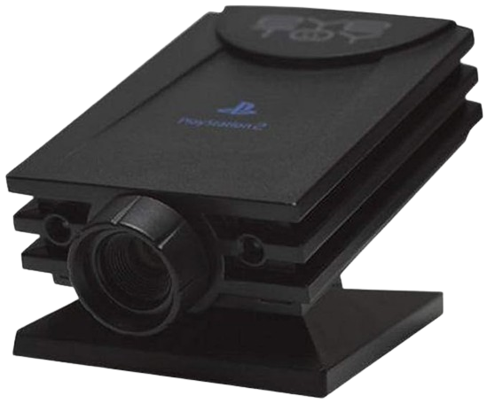
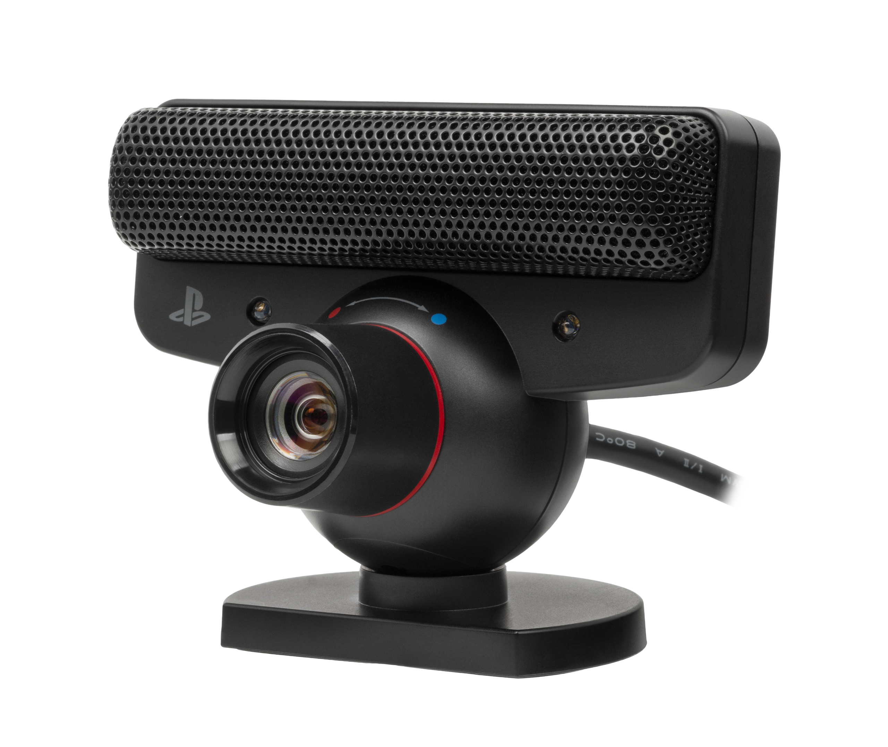
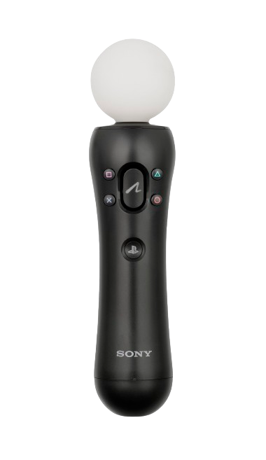
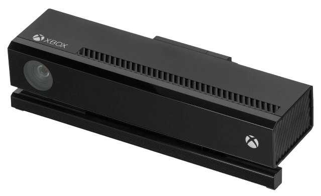
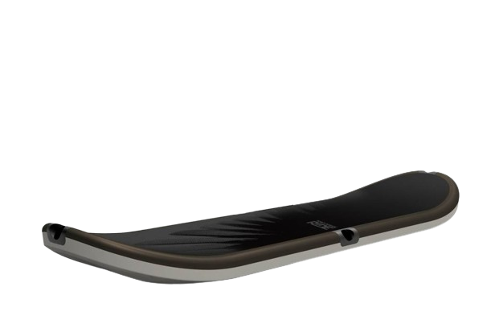

## PlayStation Motion Controllers

### PlayStation EyeToy



Used for various titles on the PlayStation 2 the most famous being the `EyeToy` game series.

#### Emulator
PCSX2


#### How to emulate in PCSX2

You need to have a `USB Webcam` connected or an `Integrated Webcam`.

- Open `RetroDECK Configurator`
- Open `PCSX2`
- Go to `Settings` -> `Controllers` -> Select `USB Port` -> Select `Webcam (EyeToy)` from the Dropdown list -> Select the `Device Name` of your connected Camera from the Dropdown list.

---

### PlayStation Eye & PlayStation Move



Used for various titles on the PlayStation 3.

#### Emulator
RPCS3

#### How to configure / emulate

WIP

---

## Xbox Motion Controllers

### Xbox 360 Kinect


Used for various titles on the Xbox 360.

#### Emulator
Xenia

#### Related Projects for Kinect usage in Linux

[Open Kinect](https://openkinect.org/wiki/Main_Page)

[Github - Open Kinect: libfreenect1](https://github.com/OpenKinect/libfreenect)

#### Udev Rules for Kinect V1

```
# ATTR{product}=="Xbox NUI Motor"
SUBSYSTEM=="usb", ATTR{idVendor}=="045e", ATTR{idProduct}=="02b0", MODE="0666"
# ATTR{product}=="Xbox NUI Audio"
SUBSYSTEM=="usb", ATTR{idVendor}=="045e", ATTR{idProduct}=="02ad", MODE="0666"
# ATTR{product}=="Xbox NUI Camera"
SUBSYSTEM=="usb", ATTR{idVendor}=="045e", ATTR{idProduct}=="02ae", MODE="0666"

# Kinect for Windows
SUBSYSTEM=="usb", ATTR{idVendor}=="045e", ATTR{idProduct}=="02c2", MODE="0666"
SUBSYSTEM=="usb", ATTR{idVendor}=="045e", ATTR{idProduct}=="02be", MODE="0666"
SUBSYSTEM=="usb", ATTR{idVendor}=="045e", ATTR{idProduct}=="02bf", MODE="0666"
```

#### How to configure / emulate

Not supported in Xenia

See issue:<br>
[Xenia Issue: 1241](https://github.com/xenia-project/xenia/issues/1241)

---

### Xbox One Kinect



Used for various titles on the Xbox One.

#### Related Projects for Kinect usage in Linux

[Open Kinect](https://openkinect.org/wiki/Main_Page)

[Github - Open Kinect: libfreenect2](https://github.com/OpenKinect/libfreenect2)

#### Udev Rules for Kinect V2

```
# ATTR{product}=="Kinect2"
SUBSYSTEM=="usb", ATTR{idVendor}=="045e", ATTR{idProduct}=="02c4", MODE="0666"
SUBSYSTEM=="usb", ATTR{idVendor}=="045e", ATTR{idProduct}=="02d8", MODE="0666"
SUBSYSTEM=="usb", ATTR{idVendor}=="045e", ATTR{idProduct}=="02d9", MODE="0666"
```

#### How to configure / emulate

Nothing

## Other Motion Controllers


### RIDE Balance Board



Used for the Activision games `Tony Hawk Ride` and `Tony Hawk Shread`.

#### Emulator
RPCS3, Dolphin

#### How to configure

WIP
---
