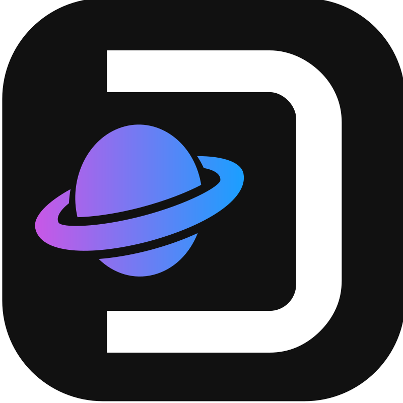
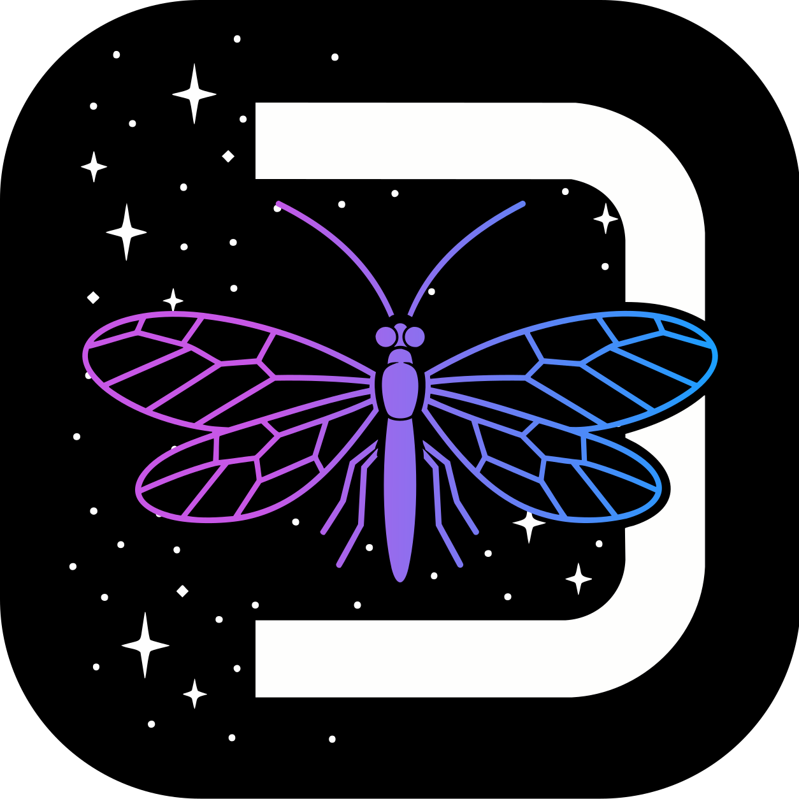
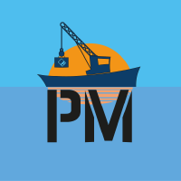

# How-to: Add a Component to RetroDECK - A Cooking Philosophy


This is the first step of creating a component and adding it into RetroDECK.

### Description

Creating a new RetroDECK component is a flexible process that can vary depending on the source of the component. However, the final structure remains consistent across all components. Building a new component in RetroDECK is like preparing a gourmet dish.

**Note:**

There’s no one-size-fits-all guide for adding a component. Each component is unique software with its own quirks, requirements and integration challenges. Use this guide as a starting point, but expect to adapt based on the specifics of what you're working with.

---

## About the Component Types

Read here for more details: 

- [Development Glossary](../../general/development-glossary.md) 
- [What is RetroDECK?](../../../wiki_about/what-is-retrodeck.md)

---

## Component Source Format: What to Prioritize?

When multiple source formats are available for a component, prioritize them in the following order for ease of integration with RetroDECK:

| Priority | Format              | Description                                                                 |
|----------|---------------------|-----------------------------------------------------------------------------|
| 1        | Flatpak             | A sandboxed package format commonly used on Linux for app distribution.     |
| 2        | AppImage            | A portable, self-contained executable that runs without installation.       |
| 3        | Precompiled Binary  | A ready-to-run executable built for a specific platform.                    |
| 4        | Build from Source   | Raw source code that must be compiled manually to a binary before use.      |

### What Is Their Recommended Release Format?

If the official documentation recommends a specific release format, use the official format first. Unofficial formats should only be considered when no official format is available.

For example, if an unofficial Flatpak is published on Flathub by an independent contributor, while the application's official team distributes only an AppImage through its GitHub repository, use the official AppImage instead.

For **Priority 4** applications that provide only source code and no official binaries, an unofficial package may be used if it automatically builds from the application's official source repository. In such cases, a Flatpak or AppImage that builds directly from the official source may be used instead of manually compiling the source for each release.


---

## Beginning: Issue, Vision, Goals and Research

### Create an Issue and Talk to the Team

If you want to add a new component either to RetroDECK as an **internal component** or to the **RetroVERSE** as an **external component**, always start by opening an [Issue on Github](https://github.com/RetroDECK/RetroDECK/issues) or check if there already is an issue of the component you want to add. 

Use the issue to explain your idea and get feedback from the RetroDECK team.

Some components might not fit with RetroDECK’s design goals or technical direction. The RetroDECK team will review each proposal and has the final say on whether a component gets included or not.

### Check Licensing, Morals and Ethics

Verify that the component meets RetroDECK's licensing, moral and ethical requirements.

- **License:** Confirm that the component's license is compatible with RetroDECK and document any relevant licensing requirements or restrictions.
- **Morals & Ethics:** Ensure the component aligns with RetroDECK's moral and ethical standards as defined in the **Social Media Guidelines**.

### Test, Research and Determine Access

Download and run the component locally to understand its behavior in its native environment and determine how it should be integrated and accessed in RetroDECK.

**Behavior & Input**

- **Settings:** Identify supported options, including keyboard/gamepad shortcuts, fullscreen or widescreen modes, auto-close behavior, and other user-configurable features.
- **Input Support:** Determine how the component's GUI can be controlled using a gamepad, mouse, keyboard, or a combination of inputs. If the component can launch games, document how those are controlled and whether input behavior can be configured or changed.

**Launch & Configuration**

- **CLI / Launch Commands:** Document supported command-line options and launch arguments.

**Filesystem & Paths**

- **Paths:** Determine whether folder paths can be customized through configuration files, CLI options, or both. Document how directories are created, including their location, purpose and creation behavior.
- **XDG Base Directories:** Determine whether the component supports the [XDG Base Directory Specification](https://specifications.freedesktop.org/basedir-spec/latest/), including `XDG_CONFIG_HOME`, `XDG_DATA_HOME`, and `XDG_CACHE_HOME`. Determine which component files belong in RetroDECK's Flatpak directories under `/home/<user>/.var/app/net.retrodeck.retrodeck/` and whether they should be stored under `config`, `data`, or `cache`.
- **Files:** Identify the files and file types used by the component, including configuration files, user data, saves, caches, logs, assets and other relevant data. Determine which files or directories should be exposed to users and mapped into the `retrodeck/` directory structure, documenting the proposed paths and their purpose. Also determine which files should be stored in the Flatpak XDG Base Directories (`config`, `data`, or `cache`), and which should remain internal or be protected by a read-only filesystem.

**Frontend & RetroDECK Integration**

- **Native Frontend Support:** Determine whether the component is already supported natively by ES-DE but not yet integrated into RetroDECK.
- **Custom Integration:** Determine whether it requires custom menu entries, system definitions, file formats, or other ES-DE configuration.
- **Configurator:** Determine whether the component should be launched, configured, or managed through the RetroDECK Configurator.

---

## Prerequisites

### Install Development Tools 

Make sure the following tools are installed on your system:

- `flatpak-builder`
- `git`
- `gh` *(optional, for GitHub CLI tasks)*

Install them using your distribution’s package manager (e.g. `apt`, `dnf`, `pacman`, etc.).

### Install Latest RetroDECK Cooker

[RetroDECK/Cooker](https://github.com/RetroDECK/Cooker)

```
flatpak remove net.retrodeck.retrodeck -y
flatpak install --user --bundle --noninteractive -y RetroDECK-cooker.flatpak 
```

### How-to: Enter the Flatpak Shell & Folders

```
flatpak run --command=bash net.retrodeck.retrodeck --debug
```

`app/` corresponds to your local Flatpak system environment.

`var/` corresponds to your local Flatpak user environment.

While the runtime itself is the "OS" of the flatpak.

**Read more here:** 

- [Folders & Filepaths](../../general/folders-filepaths.md)
- [Debug Mode](../../general/debug-mode.md)

---


## Publishing External Components 

When adding an external component, choose the option that best matches its scope, licensing, integration and support requirements.

If you are targeting your component to become an internal component of RetroDECK you can skip this step.

---

###  RetroVERSE



Choose **RetroVERSE** when the component is suitable for RetroDECK's retro-focused ecosystem.

**Read more here:**

[RetroVERSE](../../../wiki_retroverse/retroverse-guide.md)

---

### RetroLACE: Local Add-on Component Environment



**RetroLACE** or **LACE** (Local Add-on Component Environment) is a developer-oriented system for launching external components locally within RetroDECK.

RetroDECK allows users to manually install external components via RetroLACE. This feature is **Disabled** by default and must be explicitly enabled.

When enabling **RetroLACE**, users must accept a **Legal Disclaimer**.

**Read more here:**

[RetroLACE](../../../wiki_functions_guides/retrolace/retrolace-guide.md)

#### You as a developer and RetroLACE

**RetroLACE** components may be used for development, testing, or software and assets that cannot be included in RetroVERSE or RetroDECK, for example because they:

- Do not fit RetroDECK's **retro-focused scope**.
- Have **licensing restrictions** that prevent distribution through RetroDECK or RetroVERSE, but can legally be used by a user who has obtained the required licence.
- Require **proprietary software or assets** that RetroDECK cannot legally distribute.
- Are still in **development or testing** and are not ready for inclusion in RetroVERSE or RetroDECK.

Users download the component from its author's website or repository and extract it into:

`retrodeck/storage/retrodeck/retrolace/`

**Support and Responsibility: Self Distribution**

If your goal is to distrubute the component in your channels and have the users install it via **RetroLACE** as an modification or add-on.

**You** as the component author and maintainer is responsible for:

- Providing user support and maintaining the component.
- Making sure the component only installs and uses files within the RetroDECK Sandbox.
- Ensuring compliance with applicable licenses.
- Hosting and distributing the component.
- Resolving issues caused by the component.
- Taking reasonable measures to ensure the component is safe and trustworthy.

**Support and Responsibility: The Exception**

The RetroDECK Team may provide limited support for components that meet all of the following requirements:

- Are developed with the intention of becoming a built-in **Internal Component** of RetroDECK or being published on the **RetroVERSE** as an **External Component**, with RetroLACE being used as the testing and development environment.
- It complies with the **Legal Disclaimer** accepted by users of RetroLACE.
- Adhere to the moral and ethical standards defined in RetroDECKs **Social Media Guidelines**.

---

### Another Option: PortMaster



Choose **PortMaster** when it would benefit users beyond RetroDECK or falls outside the scope of RetroVERSE.

- **Scope:** Broader than RetroVERSE, supporting a wider range of games and ports.
- **Review:** Reviewed by the PortMaster team and community members.
- **Support:** Supported by the PortMaster team and community.
- **Integration:** Less directly integrated with RetroDECK. PortMaster data is maintained under `retrodeck/PortMaster`.
- **Reach:** Makes the port available to users beyond the RetroDECK ecosystem.

See the [PortMaster Porting Guide](https://portmaster.games/porting.html) for porting requirements and instructions. Continue from there, as you are no longer developing a RetroDECK component, but a PortMaster port.

---

## Guides for Component Creation

After you have taken all into account follow the one of these General Guides and begin the second step of your journey to add a Component into RetroDECK:

- **Source: Flatpak:** [Creating Component: Flatpak](component-create-flatpak.md)

- **Source: AppImage:** [Creating Component: AppImage](component-create-appimage.md)

- **Source: Binary:** [Creating Component: Binary](component-create-binary.md)

- **Source: Build from Source:** [Creating Component: Build from Source](component-create-source.md)
