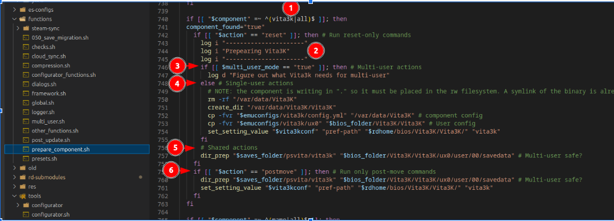
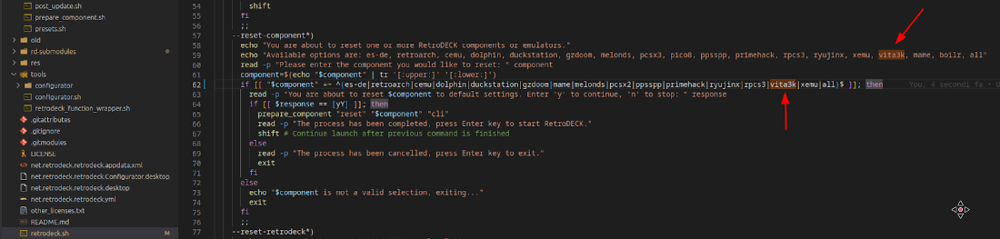

# Add a new system to RetroDECK.

This is a WIP document to show how the Ruffle emulator was added RetroDeck. From initial testing of the emulator, to integrating Ruffle into Flatpack build process and then how to integrate Ruffle into RetroDeck Configuration system for saving game data, resetting/moving config etc.


## Overview

Article assumes that the defaults path for RetroDECK are

Installation folder
```bash
~/retrodeck
```


Check from scratch for these pre -create or created in first run?

Config folder(s)
```bash
~/.var/app/net.retrodeck.retrodeck/config/ruffle
```

Data folder
```bash
~/.var/app/net.retrodeck.retrodeck/data/ruffle
```

Path to emu_configs
```bash
/app/retrodeck/emu-configs/ruffle
```

Create ruffle folder in all 3 locations above


##  Configs for Ruffle

Be sure to clean your own data (your paths, your own specific configs), and when you need to insert a path remember that Ruffle will not know what $saves_folder is, so you have to put some placeholders, for example:
RETRODECKHOMEDIR is $rdhome (aka retrodeck folder)
RETRODECKSAVESDIR is $saves_folder (aka retrodeck/saves)
RETRODECKROMSDIR is $roms_dir (aka retrodeck/roms)

you can find them all by searching the config files, I don't remember them all

Show example ruffle like this

```yml
$(EmulatorDir): RETRODECKHOMEDIR/bios/rpcs3/
/dev_hdd0/: $(EmulatorDir)dev_hdd0/
/dev_hdd1/: $(EmulatorDir)dev_hdd1/
/dev_flash/: $(EmulatorDir)dev_flash/
/dev_flash2/: $(EmulatorDir)dev_flash2/
/dev_flash3/: $(EmulatorDir)dev_flash3/
/dev_bdvd/: $(EmulatorDir)dev_bdvd/
/games/: RETRODECKHOMEDIR/roms/ps3/
```

To clean your own specific data you can move away your actual config files and make the software (Ruffle) create an empty one.
You can then compare them (I like Meld to do this) and move in the clean one only the worthy settings.

Create new version of image and move



1. - place the component name there, in this case ruffle|all (all lowercase), this means that this script is running when you reset "ruffle" or "all" the components.

1. - That is logged and even an indication for us that that part is for Ruffle

1. - Action that are executed on multi user mode ONLY

1. - Single user action: what is not multi user but single user ONLY

1. - Shared actions: something that is working regardless of the multi user mode or not, this is the part that interests you more: put all the logic here (which logic? I'll tell you later)

1. - action to be executed only when the folder are moved with the tool (like we want to move the folder and tell the configuration files where is the folder located now)

You might ignore for the moment the multi user mode stuff and put just a # TODO: add multi user mode stuff

you can just populate the postmove and the shared actions, shared actions as you can see are inside the if [[ "$action" == "reset" ]]; then without any other check.
This if [[ "$action" == "postmove" ]]; then # Run only post-move commands instead, is out of the reset function.

the reset function is called when the component is installed (aka the first time a user installs RetroDECK) and when a reset is triggered from the configurator.

Move image


Then you need to add it to the cli, as you can reset components via cli.

ruffle --saves $saves_dir ?
if you put $saves_dir probably ES-DE will fail as it doesn´t know what $saves_dir is, so you might want to create a wrapper like ${FLATPAK_DEST}/bin/ruffle-rd-wrapper.sh 
in this wrapper you can:

```bash
source /app/libexec/global.sh
ruffle --saves $saves_dir
```
in es_find_rules.xml (of ES-DE) you need to add a line where the ruffle executable is /app/bin/ruffle-rd-wrapper.sh


## Test New System Locally out side of RetroDeck

Use Meld to view default/changed config files

Ensure to remove any personal data.

custom_systems for es-de


## Integrate to RetroDeck locally


Store the default config you create in


