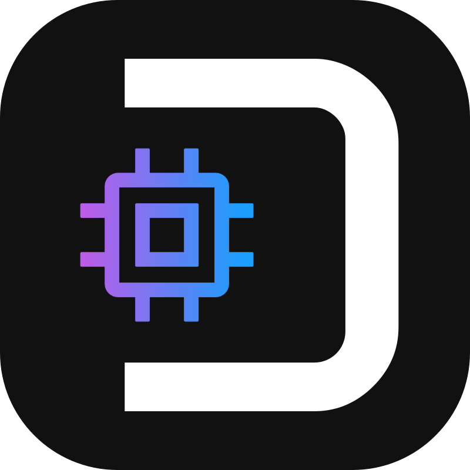
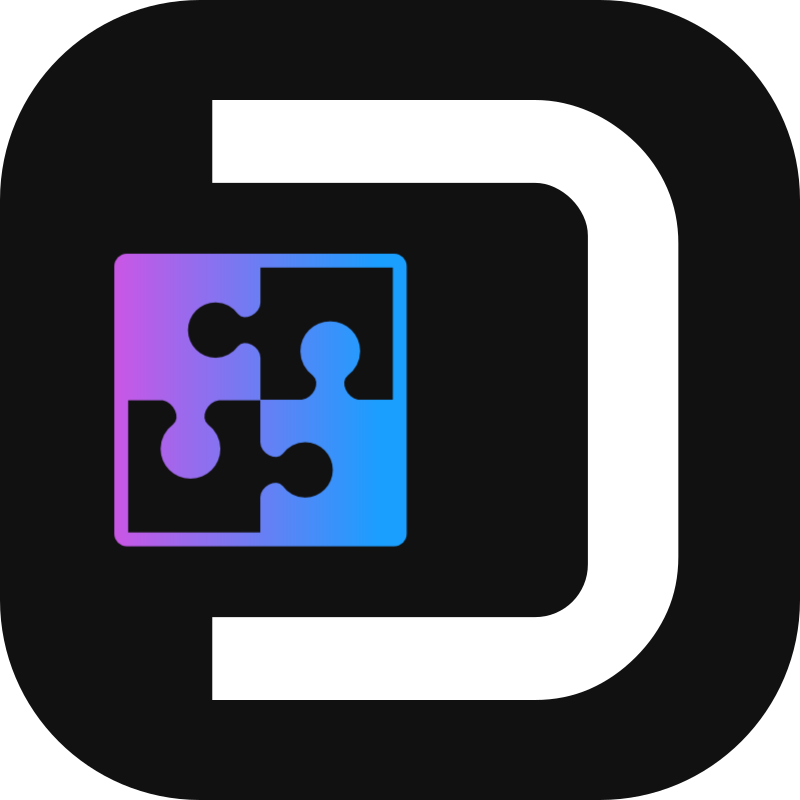

# Development Glossary 

Here we are listing all the development lingo and features of the RetroDECK Project.

*"RetroDECK uses a lot of words from Cooking / Foods in combination with Technology Jargon / Technobabble."*

## Github Repositories

#### Selected Repositories

| Name                                                                                   | Description                                           |
|----------------------------------------------------------------------------------------|-------------------------------------------------------|
| [RetroDECK/RetroDECK](https://github.com/RetroDECK/RetroDECK)                          | RetroDECK Repo: Main repo of the RetroDECK Project    |
| [RetroDECK/Cooker](https://github.com/RetroDECK/Cooker)                                | Cooker Repo: Cooker Build publication repo            |
| [RetroDECK/Wiki](https://github.com/RetroDECK/Wiki)                                    | Wiki Repo: RetroDECK mkdocs-material Wiki source code |
| [RetroDECK/RetroDECK-website](https://github.com/RetroDECK/RetroDECK-website)          | Website Repo: Retrodeck.net source code               |
| [RetroDECK/ES-DE](https://github.com/RetroDECK/ES-DE)                                  | ES-DE Repo: RetroDECK's light fork of ES-DE           |
| [RetroDECK/components](https://github.com/RetroDECK/components)                        | Components Repo: RetroDECK's central for Components   |
| [RetroDECK/RetroDECK-theme](https://github.com/RetroDECK/RetroDECK-theme)              | Theme Repo: RetroDECK's ES-DE Theme                   |
| [flathub/net.retrodeck.retrodeck](https://github.com/flathub/net.retrodeck.retrodeck)  | Flathub Repo: net.retrodeck.retrodeck                 |
| [RetroDECK/repositories](https://github.com/orgs/RetroDECK/repositories)               | Full Org Repo : All other repos in RetroDECK          |

### Main / Main Releases

The main repo of the RetroDECK Project.

Stable, feature-frozen versions of RetroDECK. Pre-releases only; full releases are on Flathub.

### Cooker / Cooker Releases

Unstable, cutting-edge development branch. Best for testers and developers.

### Feature Branches

Where new features are developed before merging into Cooker.

### Component Branch

Stores all component-related artifacts used across the project.

## RetroDECK Development to Publication Process 

How the publication process works:

1. **Feature Branches (GitHub)** / **Component Branch (GitHub)** - Initial local testing of a specific feature branch or testing a specific new component.
2. **Cooker (GitHub)** -  Merged and publication of the cooker build. Testing starts with the help of Community Testers and the rest of the RetroDECK Team. When the cooker is stable (mostly bug free 🙏) and feature complete for the scope of the release it moves on to main.
3. **Main (GitHub)** - The main release is a pre-release. After everything looks good a RetroDECK Team member will trigger the flathub publication process.
4. **Flathub Testing** - RetroDECK will first do a testbuild on flathub, the testbuild can be downloaded for the final test to verify that everything was built correctly on flathub. If all goes well it will redo the build on stable and publish.
5. **Flathub Stable** - RetroDECK is out!

### When is RetroDECK considered Released?

A version of RetroDECK is only considered released when it is published on [Flathub](https://flathub.org/apps/net.retrodeck.retrodeck).

**Communication:**

If a user asks:

*Is a new version of RetroDECK out?*

You can only answer **YES** when it has been verified that it is out on Flathub. 

## RetroDECK Framework

The `RetroDECK Framework` is the entire back-end system of RetroDECK.  
It includes everything that powers the platform, such as:

- Build system
- Functions
- Code
- Scripts
- And more...

In short, it's the engine that makes RetroDECK run.

### RetroDECK API

The `RetroDECK API` allows external applications to interact with the `RetroDECK Framework`, enabling them to operate like the RetroDECK Configurator.

Currently, the API is only accessible through:

- **Named pipes**.
- **Internal calls** within the `RetroDECK Framework`.

**Read more here:**

### RetroEngine

`RetroENGINE` lets you launch games directly from your desktop using RetroDECK — no need to open the full application.

- Supports file associations for common game file types.
- Allows launching games via the command line (CLI).

**Read more here:**

### RetroDECK Configurator

The `RetroDECK Configurator` is a unique, multi-purpose utility built into RetroDECK.

- Manages many aspects of the RetroDECK application
- Gives users access to features and functions from the `RetroDECK Framework`

It acts as the main interface between the user and the powerful tools behind the scenes.

**Read more here:**

#### RetroDECK Tool 

A `RetroDECK Tool` is the name given to a function (or group of functions) that is exposed to the end-user through the `RetroDECK Configurator`.

**Example:** `BIOS Checker Tool` - While it consists of many back-end functions, users simply know it as the `BIOS Checker Tool` in the Configurator.

### Ponzu

Ponzu is an Legacy AppImage Loader / Integrator part of the `RetroDECK Framework`.

Lets users add certain specific legacy AppImages to RetroDECK and integrates these AppImages directly into the RetroDECK environment.

**Read more here:**

### RetroDECK Assembler

The `RetroDECK Assembler` is just the building engine part of the `RetroDECK Framework`.

- It builds all aspects of RetroDECK.
- Packages them into official RetroDECK releases in various repositories.
- Publishes the final builds for distribution on Flathub Stable channels.

**Read more here:**

### LibMan

The library manager or `LibMan` is the part of the `RetroDECK Framework`. 

It's purpose is to reduce library dependency conflicts between components when libraries could be shared.

In internal jargon, LibMan is often depicted as an American Style Super Hero fighting an endless army of clones. 

### Rekku

Is [Rekku](https://github.com/apps/rekku-retrodeck) RetroDECK virtual assistant and the mascot of the RetroDECK Project.

She does GitHub bot announcements and will be more integrated into the project in the future **hopefully**.

Rekku is depicted as a "manga style blue cat girl blue retro genie".  

## RetroDECK Components

RetroDECK is made by assembling various components.

**Read more here:**

### What are Components?

A component is a complete packaged executable of a:

- Emulator
- Engine
- Port
- System
- RetroDECK: Feature & Functions

How-to build and pull from the original source is done by the each components `recipe.sh` file. 

A component is shipped with `Component Ingredient Files` in addition to the libraries and binaries that make up the software that tells RetroDECK:

- How RetroDECK should use them.
- What features/functions it has.

Inside: `/app/retrodeck/components/<component name>/`.

**Communication:**

When Components are communicated about they are referred to as (in their done packaged format): 

- `Components`
- `<Component Name> Component`

By the end-user it will just be referred as the original source.

The `recipe.sh` file is called:

- `Recipe`
- `<Component Name> Recipe`.

### What is a Engine?

A game engine is a software framework primarily designed for the development of video games which generally includes relevant libraries and support programs such as a level editor.

A Game Engine also in the context of RetroDECK is a program that allows you to run games files against that engine or via the engine executable itself:

**Examples:** 

- Solarus
- Ikemen GO 
- SCUMMVM

### What is a Emulator?

A video game console emulator is a type of emulator that allows a computing device to emulate a video game console's hardware and play its games on the emulating platform.

**Examples:**

- RetroArch
- PPSSPP

### What is a Port?

A source port is a software project based on the source code of a game engine that allows the game to be played on operating systems or computing platforms with which the game was not originally compatible. 

In the context of RetroDECK it is usually single games that are managed by the PortMaster system. 

On rare occasions RetroDECK can choose to build-in a port directly as an component.

### What is a System?

A system in the context of RetroDECK is a piece of software that is not running games but adding additional functionality in other ways.

**Examples:**

- Steam ROM Manager
- ES-DE
- PortMaster
- RetroEngine

### RetroDECK?!

RetroDECK itself with it's various tools and features is also an component.

## Component Recipe File

The **Component Recipe File:** `recipe.sh`'purpose is to tell the RetroDECK build automation system what needs to happen to take the components base source from: **AppImage**, **Flatpak**, **Precompiled Binary** or **Built from Source** and turn it into a RetroDECK Component.

The recipe file is **NOT** included in the final component package. 

**Read more here:**

## Component Ingredient Files

**What are Component Ingredient Files?**

The **Components Ingredient Files** is to feed details about the Component to the RetroDECK Framework on it's features and functions.

**Example of features:**

- Contain human-friendly information shown in menus.
- Actions to be taken when changing presets.
- Per-component one-off Bash functions.
- Config file path information and more. 
- Tells RetroDECK how-to launch it.

As these files are read in an iterative way by the code, it is imperative that their structure be correct.

**Communication:**

When they are communicated about they are referred to as: 

- `Ingredients`
- `<Component Name> Ingredient` 

### What are the Component Ingredient Files?

**component_launcher.sh**

A Bash script that serves as the launcher wrapper for a specific RetroDECK component. It is responsible for setting up the environment and executing the component within its sub-sandbox.

**component_functions.sh**

A Bash script that defines configuration file paths and component-specific functions. Component-specific path variables and functions unique to the component (e.g., firmware installation, advanced functions found in the Configurator menus).

**component_manifest.json**

The JSON file provides both informational and functional data used by the RetroDECK Framework, Configurator menus, and API calls. 

Each manifest includes:

- Component metadata (name, description, supported systems)
- Configurator menu entries
- Compatible presets and their possible states
- Actions required to apply presets
- Core-specific metadata (if applicable)

**component_prepare.sh**

A Bash script that is responsible for handling setup tasks unique to a specific component, such as:

- Resetting configuration files
- Preparing directories
- Moving or backing up data
- Post-move adjustments

