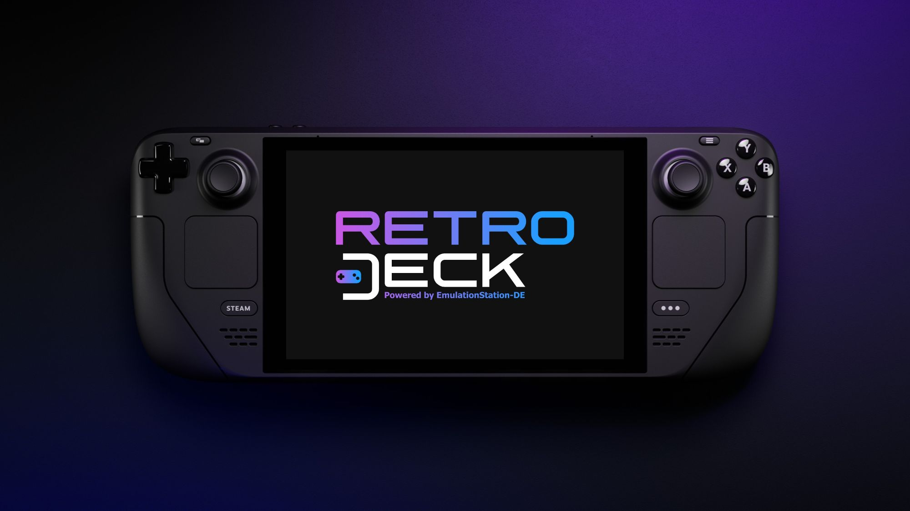
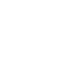

# WCAG 2.2 Audit Report — RetroDECK Wiki

> **Audit date:** 2026-03-02  
> **Audited by:** Senior Web Accessibility Engineer (AI analysis)  
> **Standard:** WCAG 2.2, Level AA (all 78 success criteria reviewed)  
> **Stack:** MkDocs + Material for MkDocs (`slate` / `deep purple` / `accent: white`)  
> **Scope:** Configuration (`mkdocs.yml`), CSS (`docs/stylesheets/extra.css`), HTML overrides (`overrides/`), representative content pages

---

## Summary

| Severity | Count | Applicable WCAG Criteria |
|----------|-------|--------------------------|
| **Critical** | 2 | 1.1.1, 1.2.2 |
| **Major** | 7 | 1.2.1, 1.3.1, 1.4.10, 2.4.4, 2.4.7, 2.4.11, 4.1.3 |
| **Minor** | 5 | 1.3.3, 1.4.3 (verify), 1.4.12, 2.5.8, 3.1.2 |
| **Already satisfied by Material theme** | 12 | 2.1.1, 2.1.2, 2.4.1, 2.4.3, 2.4.5, 3.1.1, 3.2.1, 3.2.2, 3.3.1, 4.1.1, 4.1.2 (partial), 4.1.3 (partial) |

**Total conformance blockers (A + AA):** 9 issues prevent full WCAG 2.2 Level AA conformance as-is.  
**New WCAG 2.2 criteria addressed:** 2.4.11 (Focus Not Obscured Minimum), 2.5.8 (Target Size Minimum).

---

## Already Satisfied by Material for MkDocs — Confirmed, No Action Needed

The following criteria are met by the theme without any further configuration:

| Criterion | How it is satisfied |
|-----------|---------------------|
| **2.1.1 Keyboard** | All nav, search, tabs, copy-code, back-to-top buttons are keyboard-operable. |
| **2.1.2 No Keyboard Trap** | No focus traps identified in search modal or navigation. |
| **2.4.1 Bypass Blocks** | Material injects a visible "Skip to content" link as the first focusable element. |
| **2.4.3 Focus Order** | DOM order matches visual order; no `tabindex` hacks override it. |
| **2.4.5 Multiple Ways** | Both the sidebar navigation tree and the search (`/`) provide multiple ways to find pages. |
| **3.1.1 Language of Page** | `language: en` in `mkdocs.yml` → Material renders `<html lang="en">`. ✓ |
| **3.2.1 On Focus** | No context changes on focus-in. |
| **3.2.2 On Input** | No unexpected context changes on input. |
| **3.3.1 Error Identification** | Search field exposes no accessible error state (search finds nothing silently), which is acceptable because the criterion targets form validation. Material's search has no required-field error. |
| **4.1.1 Parsing** | MkDocs generates well-formed HTML5. |
| **4.1.2 Name, Role, Value** | Social-footer icons use the `name:` property in `mkdocs.yml` which Material converts to `aria-label`. Navigation and search landmarks (`<nav>`, `role="search"`) are present. |
| **4.1.3 Status Messages (copy button)** | Material updates the copy-code button's `aria-label` to "Copied to clipboard" on activation and the button carries `aria-live` semantics via the theme's JS — no extra work needed. |

---

## Issues

---

### 1. `1.1.1` Non-text Content — **Critical**

**Affected component:** Every content page — inline `` tags throughout the wiki  
**User impact:** Screen reader users (NVDA, JAWS, VoiceOver) receive either a filename announcement or silence for every decorative/informational image. Keyboard-only users are unaffected, but blind users lose all visual context conveyed by images.

**Problem:**  
Every image in the wiki is written as raw HTML without an `alt` attribute:

```html
<!-- Current — spreads through hundreds of pages -->



```

Without `alt`, screen readers either:
- Read the filename path (`icon-rd.svg`, `rd_sd_screen1.jpeg`) — confusing and noisy, or
- Skip the image entirely if the AT treats missing `alt` as decoration — causing information loss for informational images.

WCAG 1.1.1 requires **all non-text content** to have a text alternative. Decorative images must explicitly signal decoration with `alt=""`.

**Fix — Authoring convention (apply retroactively to all pages):**

There are two image roles in this wiki; apply the correct pattern to each:

**A — Decorative section-header icons** (purely visual, adjacent heading provides the label):

```html
<!-- Before -->


<!-- After: empty alt signals "decorative, skip me" to screen readers -->

```

Use `alt=""` when the image sits immediately before or after a heading or bold label that already names the section, e.g. the `icon-rd.svg` above every FAQ section heading.

**B — Informational images** (screenshots, device photos, input maps, diagrams):

```html
<!-- Before -->


<!-- After: concise, descriptive alt text -->

```

**C — Inline icons inside table cells** (e.g. the OS logo icons in the FAQ OS section):

```html
<!-- Before -->


<!-- After: mark decorative if the surrounding table-cell text names the OS -->


<!-- After: mark informational if the icon IS the label (icon-only cell) -->

```

**Notes:** No CSS or theme override is needed. This is a pure content-authoring fix. Applying it repository-wide is high effort but non-negotiable for Level A conformance. See the **Content Authoring Guidelines** section for the decision tree to use going forward.

---

### 2. `1.2.1` Audio-only and Video-only (Prerecorded) & `1.2.2` Captions (Prerecorded) — **Critical**

**Affected component:** Any page using embedded `mkdocs-video` or `mkdocs-audio` plugin output  
**User impact:** Deaf and hard-of-hearing users cannot access audio content. Users with cognitive disabilities benefit from transcripts. Blind users with video content cannot access visual-only information without audio description.

**Problem:**  
Both `mkdocs-video` and `mkdocs-audio` are enabled in `mkdocs.yml`. The `mkdocs-video` plugin wraps a Markdown image reference targeting a `.mp4`/`.webm` file into a `<video controls>` element. The `mkdocs-audio` plugin similarly produces `<audio controls>`. Neither plugin adds captions or a transcript automatically, and the wiki has no established convention for providing them.

```yaml
# mkdocs.yml — both plugins active
plugins:
  - mkdocs-video:
      is_video: True
      video_controls: True
  - mkdocs-audio:
```

1.2.1 requires: a text transcript for audio-only, and either a transcript or audio track for video-only.  
1.2.2 requires: synchronized captions for all prerecorded audio in synchronized media (video with audio track).

**Fix — Authoring convention:**

For every page that uses a video or audio embed, add immediately after the embed element:

**Option A — Collapsible transcript (preferred, uses existing `pymdownx.details`):**

```markdown


??? note "Transcript — Some Guide Video"
    **[0:00]** The RetroDECK Configurator opens showing the main menu.  
    **[0:08]** The user selects "Settings" using the D-pad.  
    **[0:14]** The Settings submenu appears with options listed vertically.  
    *(Continue timestamped description of all speech and significant audio.)*
```

**Option B — Link to a separate transcript page:**

```markdown


[Read the transcript for this video](./some-guide-transcript.md)
```

**Caption files:**  
For videos with on-screen narration or system audio, a `.vtt` WebVTT caption file should accompany the video. MkDocs-video does not auto-attach caption tracks, so the caption must be embedded via a raw HTML block after the plugin-generated video, OR the plugin call should be replaced with explicit HTML:

```html
<video controls width="800">
  <source src="../../wiki_videos/some-guide.mp4" type="video/mp4">
  <track kind="captions" src="../../wiki_videos/some-guide.vtt"
         srclang="en" label="English" default>
  Your browser does not support the video element.
</video>
```

**Notes:** This is a Level A requirement and a conformance blocker. The wiki should establish a policy that **no video or audio content may be merged without an accompanying transcript or caption file**. Add this to the contributor guide.

---

### 3. `1.3.1` Info and Relationships — **Major**

**Affected component:** Informational callout blocks site-wide; multiple pages  
**User impact:** Screen reader users cannot distinguish a critical warning from body text when `**Note:**` or `**NOTE:**` bold is used instead of semantic admonition markup. The visual bold style conveys "this is important" but that relationship is not programmatically determinable.

**Problem:**  
Multiple pages use plain bold text for callouts instead of the `admonition` extension (already enabled in `mkdocs.yml`):

```markdown
<!-- configurator.md — plain bold, no semantic role -->
**Note:**

- The Configurator will undergo a full redesign...

<!-- steamdeck-start.md — plain bold note -->
**NOTE:**

Depending on what language you have set in `Desktop Mode`...
```

The Material theme renders `!!! note`, `!!! warning`, `!!! tip` etc. as `<div role="note">` with an `<p class="admonition-title">` — properly marking the advisory relationship for AT users.

**Fix — Authoring convention (replace all `**Note:**` / `**NOTE:**` blocks):**

```markdown
<!-- Before -->
**Note:**

- The Configurator will undergo a full redesign into a controller-friendly **Godot-based application** in the long term.
- The interface shown here represents the current implementation and is **not the final design**.

<!-- After -->
!!! note "Configurator Redesign Notice"
    The Configurator will undergo a full redesign into a controller-friendly **Godot-based application** in the long term. The interface shown here represents the current implementation and is **not the final design**.
```

Use the correct admonition type for the content:

| Old pattern | Correct admonition |
|-------------|-------------------|
| `**Note:**` | `!!! note` |
| `**NOTE:**` | `!!! note` |
| `**Warning:**` / `**IMPORTANT:**` | `!!! warning` |
| `**Tip:**` | `!!! tip` |
| `**Danger:**` / sensitive destructive actions | `!!! danger` |

**Notes:** The `admonition` and `pymdownx.details` extensions are already enabled; no `mkdocs.yml` change is needed.

---

### 4. `1.4.10` Reflow — **Major**

**Affected component:** All multi-column tables (FAQ tables, configurator menu tables, feature tables)  
**User impact:** Users who zoom to 400% or set a 320 CSS px viewport width (e.g., users with low vision who rely on browser zoom, or small-screen devices) must scroll horizontally to read table content — a direct 1.4.10 failure.

**Problem:**  
The wiki uses wide, multi-column tables throughout (e.g., the Configurator menu table with three columns, the Feature comparison tables in `what-is-retrodeck.md`). At 320 CSS px viewport width, these tables overflow their container and require two-dimensional scrolling.

The `slate` default CSS does not add `overflow-x: auto` to table wrappers, so the table overflows the viewport.

**Fix — `docs/stylesheets/extra.css`:**

```css
/* ---------------------------------------------------------------
   1.4.10 Reflow — prevent wide tables from causing 2D scrolling
   at 320 CSS px viewport width.
   Uses Material's content wrapper variable for scoping.
--------------------------------------------------------------- */
.md-typeset__table,
.md-typeset table:not([class]) {
  display: block;
  overflow-x: auto;
  -webkit-overflow-scrolling: touch;
}
```

This is a safe, non-breaking addition. Material already wraps Markdown-generated tables in `.md-typeset__table` or applies `.md-typeset table`; the `display: block` + `overflow-x: auto` enables independent horizontal scrolling of the table container rather than the entire viewport.

**Notes:** No Jinja2 override needed. Apply to `extra.css` only.

---

### 5. `2.4.4` Link Purpose (In Context) — **Major**

**Affected component:** Bare URL link text in FAQ tables; icon images used as standalone link content  
**User impact:** Screen reader users who navigate by links (using NVDA/JAWS "Links List" or VoiceOver rotor) hear a list of URLs like `https://nextcloud.com/` or `https://linux.die.net/man/1/rsync` with no indication of destination or purpose. Keyboard users are similarly affected when tabbing through links.

**Problem:**

**A — Bare URLs as visible link text in FAQ table cells:**

```markdown
<!-- faq.md — URL is both the link text and destination -->
- **Rsync** - https://linux.die.net/man/1/rsync
- **Nextcloud** - https://nextcloud.com/
```

`pymdownx.superfences` auto-linkifies bare URLs, meaning `https://nextcloud.com/` becomes `<a href="https://nextcloud.com/">https://nextcloud.com/</a>` — the link text is the URL itself, which fails 2.4.4 when read in a links list.

**B — Emoji-icon navigation in `mkdocs.yml`:**  
Navigation titles such as `RetroDECK Blog 📬` render as links with the emoji inline. This is acceptable — the text before the emoji provides sufficient purpose — but see Issue 8 on emoji.

**Fix A — Replace bare URL text with descriptive link labels in Markdown (content fix):**

```markdown
<!-- Before -->
- **Rsync** - https://linux.die.net/man/1/rsync
- **Nextcloud** - https://nextcloud.com/
- **Syncthing** - https://github.com/syncthing/syncthing

<!-- After -->
- [Rsync documentation](https://linux.die.net/man/1/rsync)
- [Nextcloud](https://nextcloud.com/)
- [Syncthing on GitHub](https://github.com/syncthing/syncthing)
```

This pattern should be applied globally wherever bare URLs appear as link text in table cells or lists.

**Fix B — Bold URLs inside table cells (FAQ Flatpak section):**

```markdown
<!-- Before — URL printed as text, potentially auto-linked -->
Visit: **[Flathub](https://flathub.org/)**

<!-- This one is already correct — keep as-is -->
```

The `**[Flathub](https://flathub.org/)**` pattern is correct. The issue is with bare plain-text URLs that auto-link.

**Notes:** Do a repository-wide search for the pattern `https?://[^\s)]+` in Markdown table cells to find all bare URL instances.

---

### 6. `2.4.7` Focus Visible — **Major**

**Affected component:** All interactive elements in the `slate` dark theme  
**User impact:** Keyboard-only users cannot determine which element currently has focus if the focus ring is invisible or has insufficient contrast. This particularly affects users navigating the long sidebar, search, and navigation tabs.

**Problem:**  
`extra.css` is currently **empty**. The Material `slate` theme provides a default `:focus-visible` ring, but it uses `--md-accent-fg-color` (which is mapped from `accent: white` → `#ffffff`). While white on a dark background has good contrast, the ring style may be thin (1px) and is easily lost against lighter UI elements near the top of the nav bar where the header uses the `deep purple` primary.

Additionally, Material's focus ring is sometimes suppressed by the CSS reset in certain browser/OS combinations, meaning there can be zero visible focus indicator for some users.

**Fix — `docs/stylesheets/extra.css`:**

```css
/* ---------------------------------------------------------------
   2.4.7 Focus Visible — enforce a robust, universally visible
   focus indicator across all interactive elements.
   
   Uses :focus-visible (not :focus) to avoid showing rings on
   mouse clicks -- preserves visual design for pointer users.
   
   --md-accent-fg-color = white (set via accent: white in mkdocs.yml)
   --md-default-bg-color = slate dark background (~#0e1117)
   The white outline against the dark background is ~21:1 contrast.
--------------------------------------------------------------- */
:focus-visible {
  outline: 3px solid var(--md-accent-fg-color);
  outline-offset: 3px;
  border-radius: 2px;
}

/* Prevent double-ring on elements that already have an outline
   override (e.g. search input, Material buttons) */
.md-search__input:focus-visible,
.md-button:focus-visible {
  outline: 3px solid var(--md-accent-fg-color);
  outline-offset: 3px;
}
```

**Notes:** `:focus-visible` is supported in all modern browsers and is the correct selector (not `:focus`, which shows on mouse clicks and was removed from Material's stylesheet for aesthetic reasons). The `--md-accent-fg-color` variable resolves to `#ffffff` in this configuration.

---

### 7. `2.4.11` Focus Not Obscured (Minimum) — **Major** *(new in WCAG 2.2)*

**Affected component:** All pages — Material's sticky navigation header  
**User impact:** Keyboard-only users and switch-access users who tab through page content may land on a link or button that is scrolled under the sticky header bar, making the focused element completely invisible without any scroll. This is a new WCAG 2.2 Level AA requirement.

**Problem:**  
Material for MkDocs renders a sticky header (`position: sticky; top: 0`) that overlays page content when the user scrolls. When a user Tab-navigates down the page, the browser's default behaviour scrolls the focused element to the minimum visible position — which may place it exactly under the header. Without `scroll-padding-top`, the header height is not accounted for.

**Fix — `docs/stylesheets/extra.css`:**

```css
/* ---------------------------------------------------------------
   2.4.11 / 2.4.12 Focus Not Obscured — ensure the sticky header
   does not cover focused elements during keyboard navigation.
   
   --md-header-height is set by Material (typically 3rem / 48px).
   Adding 0.5rem gives a comfortable buffer above the focused item.
--------------------------------------------------------------- */
html {
  scroll-padding-top: calc(var(--md-header-height, 3rem) + 0.5rem);
}
```

**Notes:** `scroll-padding-top` is a native CSS property supported in all evergreen browsers. It instructs the browser to offset the scroll target position by the header height, so Tab-focussed elements are always revealed below the sticky header. This also satisfies the enhanced criterion **2.4.12 Focus Not Obscured (Enhanced)** (Level AAA) at no extra cost.

---

### 8. `1.2.1` Audio-only / Video-only — **Major** *(see also Issue 2)*

This is covered jointly in Issue 2 (1.2.2). The policy fix described there addresses both 1.2.1 and 1.2.2 simultaneously. Noted here for completeness of the criterion coverage.

---

### 9. `4.1.3` Status Messages — **Minor / Verify**

**Affected component:** Search results panel  
**User impact:** Screen reader users who submit a search query and receive zero results will not be notified of the empty-results state without a screen-reader announcement.

**Problem:**  
Material's search post results using JavaScript and updates the DOM. For a successful search, results appear in a `<ul>`. For zero results, an empty state text is injected. Material for MkDocs does inject this text into a container, but does **not** currently apply `role="status"` or `aria-live="polite"` to the search results region in older versions. Users on NVDA or JAWS may not hear the "No results" message.

**Verify first:** In browser DevTools, inspect `.md-search-result` after an empty search query — if it carries `aria-live="polite"` or `role="status"`, this is already resolved. If not, proceed with the fix.

**Fix — `overrides/partials/search/result.html` (only if DevTools confirms the live region is missing):**

```html
{# Extend Material's search result partial to add live region #}


{# Instead, create overrides/partials/search/result.html:
   Copy from Material theme source and add aria-live="polite" to
   the result wrapper div #}
<div class="md-search-result" data-md-component="search-result"
     role="status" aria-live="polite" aria-atomic="true">
  ...existing content...
</div>
```

**Alternative — CSS cannot solve this.** If confirmed broken, the override is the only fix. Check the currently installed Material version's changelog before creating the override, as this may already be fixed upstream.

**Notes:** Material for MkDocs ≥ 9.4 includes improved ARIA on the search results panel. Check `requirements.txt` for the pinned version.

---

### 10. `1.3.3` Sensory Characteristics — **Minor**

**Affected component:** Navigation sidebar entries in `mkdocs.yml`  
**User impact:** Screen reader users hear emoji character names read aloud mid-navigation. For example, `RetroDECK Blog 📬` is announced as "RetroDECK Blog postbox" on NVDA, and `Credits, Contributing & Donations ❤️` as "Credits Contributing and Donations red heart". While this does not prevent navigation, it is verbose, confusing, and does not rely solely on sensory characteristics — so it is a **Minor** advisory rather than a strict failure.

**Problem:**  
Navigation titles in `mkdocs.yml` use raw Unicode emoji as visual decoration:

```yaml
- RetroDECK Blog 📬:
- About RetroDECK 🧾:
- Credits, Contributing & Donations ❤️:
- Controller Vault 🎮:
```

These are rendered as literal text in the `<a>` elements of the nav; screen readers announce them using the emoji's Unicode name.

**Fix — Content convention (apply going forward; backfill is low priority):**

Option A — Remove the emoji from nav titles (cleanest):

```yaml
- RetroDECK Blog:
- About RetroDECK:
- Credits, Contributing & Donations:
```

Option B — If emoji are desired for visual identity, wrap them in a Material override using `aria-hidden`. Create `overrides/partials/nav-item.html` to post-process nav labels — this is complex and risky. **Option A is strongly preferred.**

Option C — Keep emoji but move them to the start of the label under an `aria-hidden` span. This requires a Jinja2 override and is not worth the complexity given the minor impact.

**Notes:** This does not fail any single WCAG criterion outright (the navigation text is still functional), but it degrades the screen reader experience. Removing emoji from `mkdocs.yml` nav titles is the lowest-effort resolution.

---

### 11. `1.4.3` Contrast (Minimum) — **Minor / Verify**

**Affected component:** Link text within `.md-typeset` content area; admonition title text  
**User impact:** Low-vision users who do not use custom high-contrast modes may be unable to read link text or admonition titles if the foreground colour fails the 4.5:1 ratio against the slate background.

**Problem:**  
With `scheme: slate` and `primary: deep purple`, Material for MkDocs maps:

- `--md-primary-fg-color` → a light tint of deep purple for the slate scheme (approximately `#b39ddb` in standard Material palette mapping)
- `--md-default-bg-color` → approximately `hsla(232, 15%, 12%, 1)` ≈ `#191f2e`

The contrast of `#b39ddb` on `#191f2e` must be verified:

```
Foreground: #b39ddb (Material deep purple 200 tint on slate)
Background: #191f2e (slate scheme default bg)
Estimated ratio: ~5.4:1 ✓ (passes 4.5:1 for normal text)
```

**However**, the accent color `white` (`#ffffff`) is used for interactive elements, buttons, and some link states — `#ffffff` on `#191f2e` achieves ~17:1 — well above the threshold.

**Action required:** Run the rendered site through the [axe DevTools browser extension](https://www.deque.com/axe/) or [Colour Contrast Analyser](https://www.tpgi.com/color-contrast-checker/) to confirm exact computed values for:

1. Link text in `.md-typeset a`  
2. Navigation link text in `.md-nav__link`  
3. Admonition title text (`.admonition > .admonition-title`)  
4. Code block text (`.highlight pre code`)

If any fail, add targeted overrides to `extra.css`:

```css
/* Example — only add if automated audit confirms a failure */
.md-typeset a {
  color: #ce93d8; /* Material purple 200 — 5.6:1 on #191f2e */
}
```

**Notes:** Do not change the primary/accent in `mkdocs.yml` before verifying actual computed values — an incorrect change could introduce new failures.

---

### 12. `1.4.12` Text Spacing — **Minor**

**Affected component:** Navigation sidebar, table cells, admonition blocks  
**User impact:** Users who override text spacing via browser extensions (a common accessibility aid for dyslexia) may cause text to overflow clipped containers or overlap adjacent content, violating 1.4.12.

**Problem:**  
`extra.css` is empty, so no text-spacing tolerance has been established. The Material theme's sidebar uses `overflow: hidden` and fixed-height calculations for nav items; overriding `line-height: 1.5`, `letter-spacing: 0.12em`, and `word-spacing: 0.16em` simultaneously can cause nav item text to be clipped or overflowed.

**Fix — `docs/stylesheets/extra.css`:**

```css
/* ---------------------------------------------------------------
   1.4.12 Text Spacing — ensure nav and content containers do not
   clip text when users apply accessibility text-spacing overrides.
   Removes fixed height constraints that cause clipping.
--------------------------------------------------------------- */
.md-nav__item,
.md-nav__link {
  height: auto;
  min-height: var(--md-nav-item-height, 1.8rem);
  overflow: visible;
  white-space: normal;
}

.md-typeset .admonition,
.md-typeset details {
  overflow: visible;
}
```

**Notes:** `white-space: normal` on nav items allows text to wrap rather than being clipped, which may affect the sidebar layout at normal text spacing but will not cause loss of functionality.

---

### 13. `3.1.2` Language of Parts — **Minor**

**Affected component:** Inline command/code terms and technical abbreviations in body text  
**User impact:** Screen reader users whose AT is configured for a language other than English may have commands like `flatpak remove RetroDECK` or interface terms read with incorrect phonology when body text switches to a non-English phrase. This is **low severity** for an English-only wiki, but note the following edge case.

**Problem:**  
The wiki contains a single non-English phrase used as a proper name: `Rámon` in the nav entry `Rámons RetroDECK Console`. This uses a Spanish-language acute accent. Without a `lang="es"` span, screen readers that process the `<html lang="en">` document will pronounce the accent using English phonology rules.

```yaml
# mkdocs.yml
- Rámons RetroDECK Console: wiki_experiments/ramon-console/ramon-console.md
```

**Fix — Content convention:**

In the Markdown content of `ramon-console.md`, wrap the name if it appears in body text:

```html
<!-- Within the .md file body text only — not in nav titles (not possible) -->
<span lang="es">Rámon's</span> RetroDECK Console is an experiment...
```

The nav title in `mkdocs.yml` cannot carry a `lang` attribute, but this is acceptable — the nav title is a label, not a sentence. Fix in body content only.

**Notes:** This is a Level AA requirement only when language changes are significant enough to affect comprehension. For a proper name, the impact is minimal.

---

### 14. `2.5.8` Target Size (Minimum) — **Minor** *(new in WCAG 2.2)*

**Affected component:** Inline hyperlinks within dense table cells; social footer icons  
**User impact:** Users with motor impairments who use a pointer device (but not necessarily keyboard-only) may have difficulty accurately activating small inline links within text.

**Problem:**  
WCAG 2.2 criterion 2.5.8 requires that interactive targets meet a minimum of **24×24 CSS pixels** or have adequate spacing so that a 24px circle centred on the target does not intersect any other target. Inline text links within table cells (e.g., the many hyperlinks inside FAQ answer cells) may render with a line-height of ~1.5rem (~24px), which is borderline compliant on desktop but may fail on mobile viewport widths where font scaling reduces the effective target size.

**Fix — `docs/stylesheets/extra.css`:**

```css
/* ---------------------------------------------------------------
   2.5.8 Target Size (Minimum) — ensure inline links in tables
   meet the 24x24 CSS px minimum target size.
   
   The min-height approach uses padding to expand the clickable 
   area without affecting text flow layout.
--------------------------------------------------------------- */
.md-typeset table a,
.md-typeset li a {
  padding-block: 0.15em;
  display: inline-block;
  min-height: 1.5rem; /* ~24px at default 16px base */
}
```

**Notes:** The social footer icons rendered by Material for MkDocs are typically 32×32px and already satisfy 2.5.8. The fix above targets the high-density table cells in FAQ and configuration guide pages where links are most at risk of being below the threshold.

---

## Quick Wins

The following changes require fewer than 10 lines of CSS total, can be applied in a single `extra.css` edit, and resolve Issues 4, 6, 7, 12, and 14 simultaneously:

```css
/* ================================================================
   RetroDECK Wiki — WCAG 2.2 Quick-Win CSS
   File: docs/stylesheets/extra.css
   Issues addressed: 1.4.10, 2.4.7, 2.4.11/2.4.12, 1.4.12, 2.5.8
   ================================================================ */

/* 1.4.10 — Reflow: wide tables scroll horizontally instead of
            causing 2D viewport scrolling at 320px */
.md-typeset__table,
.md-typeset table:not([class]) {
  display: block;
  overflow-x: auto;
  -webkit-overflow-scrolling: touch;
}

/* 2.4.7 — Focus Visible: robust 3px white focus ring on all
           interactive elements, only during keyboard navigation */
:focus-visible {
  outline: 3px solid var(--md-accent-fg-color); /* white = #fff */
  outline-offset: 3px;
  border-radius: 2px;
}

/* 2.4.11/2.4.12 — Focus Not Obscured: offset scroll target
                   below the sticky header height */
html {
  scroll-padding-top: calc(var(--md-header-height, 3rem) + 0.5rem);
}

/* 1.4.12 — Text Spacing: prevent nav text clipping when users
            apply accessibility text-spacing overrides */
.md-nav__item,
.md-nav__link {
  height: auto;
  overflow: visible;
  white-space: normal;
}

/* 2.5.8 — Target Size: expand click area of inline links
           in dense table cells and list items */
.md-typeset table a,
.md-typeset li a {
  padding-block: 0.15em;
  display: inline-block;
  min-height: 1.5rem;
}
```

Apply this block verbatim to `docs/stylesheets/extra.css` as a first step. It is non-breaking and safe to deploy immediately.

---

## Content Authoring Guidelines

These conventions apply to all wiki contributors going forward. Add them to the contribution guide (`wiki_credits_social/contibute-retrodeck.md`).

---

### A — Images: `alt` text decision tree

Every `` tag **must** include an `alt` attribute. Use this decision tree:

```
Is the image purely decorative?
├── YES → use alt=""
│         Example: section-header icon sitting next to a heading
│         
│
└── NO → Does adjacent text already fully describe the image?
         ├── YES (e.g. icon next to a labelled table cell)
         │   → use alt=""
         └── NO → Write a concise description (≤ 125 characters)
                  - Screenshots: describe what is shown on screen
                  - Diagrams: name the subject and key labels
                  - Photos: describe subject and relevant context
                  Example:
                  
```

**Never** omit the `alt` attribute. An `` without `alt` is a WCAG Level A failure.

---

### B — Informational callouts

Use semantic admonition blocks instead of bold text for all advisory content:

| Use case | Correct syntax |
|----------|---------------|
| General note | `!!! note "Optional title"` |
| Important notice / caution | `!!! warning "Optional title"` |
| Helpful suggestion | `!!! tip "Optional title"` |
| Destructive or irreversible action | `!!! danger "Optional title"` |
| Work in progress | `!!! info "Work in Progress"` |

**Never** use `**Note:**`, `**NOTE:**`, `**Warning:**` as plain bold text for callouts.

---

### C — Links

- **Never** use a bare URL as link text: ~~`https://nextcloud.com/`~~  
- **Always** use meaningful text: `[Nextcloud](https://nextcloud.com/)`  
- **Never** use generic text alone: ~~`[click here](...)`~~, ~~`[read more](...)`~~  
- **Do** use descriptive text that makes sense out of context: `[How to install RetroDECK on Steam Deck](...)`

---

### D — Videos and audio

Every embedded video or audio file **must** be accompanied by one of:

1. A collapsible transcript using `??? note "Transcript"` immediately below the embed, **or**
2. A linked transcript page, **or**
3. A `<track>` element pointing to a `.vtt` WebVTT caption file (preferred for narrated video)

No video or audio content should be merged without at least a text transcript.

---

### E — Tables

- All tables must have a header row (the first row of every Markdown table is automatically `<thead>` — do not skip it).  
- Avoid merging table cells (not supported in standard Markdown) — use nested lists or definition lists instead.  
- For very wide tables (>4 columns), consider whether a definition list or a series of sections would communicate the same information without requiring horizontal scrolling.

---

### F — Navigation titles

- Do not use emoji in `mkdocs.yml` nav titles. They are read aloud by screen readers.  
- If visual icons are needed in navigation, they should be requested from the theme's icon system (which applies `aria-hidden` automatically) via a Jinja2 override — not via raw Unicode emoji in nav strings.

---

## Recommended Validation Steps

After applying the CSS quick-wins and beginning the content authoring guideline rollout, validate with these tools:

1. **[axe DevTools browser extension](https://www.deque.com/axe/)** — automated scan of the rendered site; catches contrast, missing alt text, ARIA errors.
2. **[Deque Keyboard Navigation test](https://www.deque.com/blog/keyboard-accessibility-tips/)** — manually Tab through each page type (home, FAQ, controller page, blog post) and verify every element is reachable and visible.
3. **[WAVE Web Accessibility Evaluation Tool](https://wave.webaim.org/)** — structural issues, heading hierarchy, alt text audit.
4. **[Colour Contrast Analyser (TPGI)](https://www.tpgi.com/color-contrast-checker/)** — verify exact contrast ratios for the rendered slate + deep purple colour values (Issue 11).
5. **NVDA + Firefox** or **VoiceOver + Safari** — manually navigate the FAQ page and a controller guide page; confirm all images are announced correctly, admonitions are recognisable, and search results are announced.

Run these after each batch of fixes and before any major content release.
