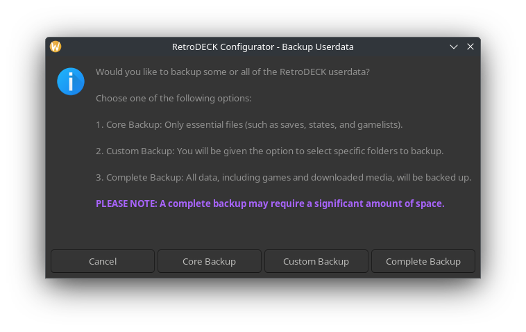

# How-to: Backup RetroDECK

## The Backup RetroDECK Tool

The backup tool creates a `.zip` file of your selected type of backup and puts it under: `/retrodeck/backups`

### How-to: Use the Backup RetroDECK Tool

Navigate to -> `RetroDECK Configurator` -> `Data Management Tools` -> `Backup RetroDECK`.

The Backup RetroDECK Tool comes with three choices:

- **Core Backup**: Backs up only essential files, such as saves, states, and gamelists.

- **Custom Backup**: Allows you to select specific folders to back up.

- **Complete Backup**: Backs up all data, including games and downloaded media.

**Depending on:**

- The type of backup
- Your hardware 
- The size and amount of what you are backing up

It could take a while and take a lot of space.
