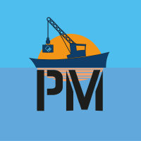

# October 2024: Spooky Update

Highlights:

- Godot Configurator - Status
- PortMaster - Status

<!-- more -->

## Spooky update

It's once again time for a blogpost on what we have been working on for the past month.

---

Captain Comeback

---

## Godot Configurator - Status

Developer MonkeyX of the RetroDECK Team is hard at work with his Godot Magic (we are happy to have him).

- Here we show a more updated navigation.
- More colorful.

---

## PortMaster - Status

The PortMaster X86_64 version is coming along slow and steady. We are working togheter with the PortMaster team to make this happen. It offers a plethora of FOSS games, game engines and other custom games.

**Question: How many ports are available currently in development?**

So far there about 40-50 ports already for X86_64.

As stated in a previous blog the goal is NOT to have all 600+ ports in X86_64 as it does not makes sense. Only games that have

**Question: Where will the portmaster ports directory be?**

It will be under `roms/portmaster/`

**Question: Will PortMaster be part of 0.9.0b?**

We *hope* to ship is as part of the update. But it is also a quite big feature in addition to the Godot Configuror (let's see where we are when the time comes).

---

## Ryujinx Issues - Status

We are still working with and having open dialog with the Ryujinx Team on this. They hope to make their pathing more dynamic to solve that the Emulator can't find several files in an upcoming Ryujinx update. But the problem is quite complex.

Depending on where we and they are in development

---

## SRM (Add to Steam) - Status

We have had good dialog and cooperation with the SRM Team to make this feature a reality. But RetroDECK's implementation is quite different as we don't plan to let the users open the SRM interface at all.

---

### How can I help out?

If you want to help out with our efforts, please post your interest in the 💙-i-want-to-help in either Matrix or Discord.

We are always looking for more developers, artists or testers that can contribute to RetroDECK.

## That is all for now

There are more things we are working on, but you will see them in future blog updates!

Thanks everyone!

//The RetroDECK Team

### Links

[Discord](https://discord.gg/WDc5C9YWMx)

[Matrix](https://matrix.to/#/#retrodeck:matrix.org)

[Github](https://github.com/XargonWan/RetroDECK)

[Wiki](https://github.com/XargonWan/RetroDECK/wiki)

[Donations](https://retrodeck.readthedocs.io/en/latest/wiki_about/donations-licenses/)

[Lemmy](https://lemmy.zip/c/retrodeck)
