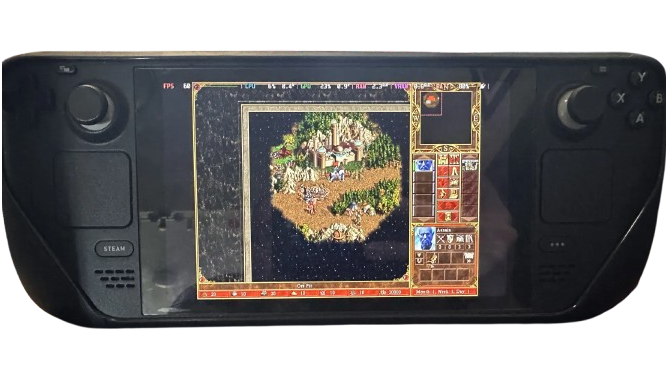
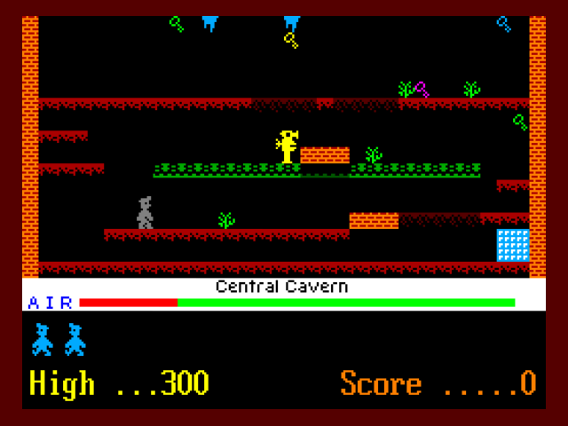
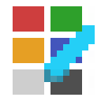
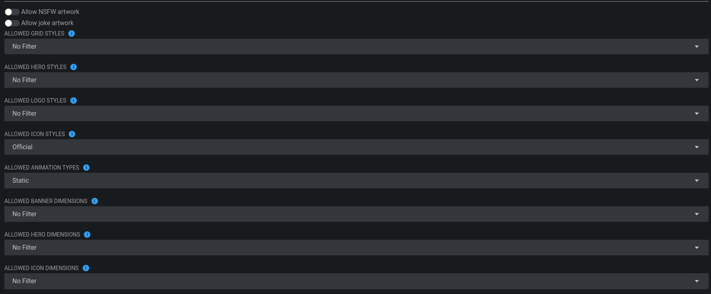

# October 2024: Spooky Update

Highlights:

- Godot Configurator - Status
- PortMaster - Status
- Ryujinx Issues - Status
- Steam ROM Manager - SRM (Add to Steam) - Status

<!-- more -->

## Spooky update

It's once again time for a blogpost on what we have been working on for the past month.


## Captain Comeback - 0.9.0b

As we hit the CC letters with this update, we internally debated long on what the name of the update should be.

The official name for 0.9.0b is now: `Captain Comeback`.

As we have rewritten the entire application from the ground up with the new `Lighter Manifest` in addition to shipping the new `Godot Configurator`.
It does feel like a comeback.

---


## Godot Configurator - Status


As always everything is W.I.P and subject to change.

The RetroDECK Team have kept working on Godot since last month. MonkeyX have put his heart and soul into this and we are happy to have him :)

We are showing off:

- Updated navigation.
- Updated keygrid.
- More colors.
- Navigation sounds.
- Description windows that descibe the function.

### ItzSelenux special thanks

We also want to thank [ItzSelenux / ItsZariep](https://github.com/ItzSelenux/) for helping us making all of the pixelart icons and logos.

We mostly ItzSelenux art for both the Steam Input radial menus and Godot Configurator via his Pixelitos Icon Theme for the Linux Desktop.

If you are Spanish speaking you might want to follow his YouTube channel various FOSS topics do so here:

[ItzSelenux - Youtube](https://www.youtube.com/ItzSelenux)

If you like our radial menus please give him a follow on YouTube and/or a Star on GitHub.

---


## PortMaster - Status

 

The [PortMaster](https://portmaster.games/games.html) `x86_64` version is coming along slow and steady.

We are working togheter with the PortMaster team to make this happen. It offers a plethora of FOSS games, game engines and other custom games.

Thanks PortMaster Team! ❤️


### Question: How many ports are available currently being ported to x86_64?

So far there about **40-50** ports are already done.

### Question: Will all ports be available in the long run?

As stated in a previous blogpost the goal is NOT to have all 600+ ports available.

The primary goal of PortMaster is to port to ARM devices.

Several of the ports are redundant to offer for x86_64 and you already have a better way to play them directly via native launchers that most times offer better features.

But there could be some overlap for some games.

Linux already offers several ways to install big chunk of these ports: Flathub, Snapcraft, Luxtorpeda runner on Steam, Lutris, Heroic, etc...

### Question: Where will the portmaster ports directory be?

It will be under `roms/portmaster/`

### Question: Will PortMaster be part of 0.9.0b?

We *hope* to ship is as part of the update. But it is also a quite big feature in addition to the Godot Configuror (let's see where we are when the time comes).

---


## Ryujinx Issues - Status


We are still working with and having open dialog with the Ryujinx Team on this.

They hope to make their pathing more dynamic to solve that the Emulator can't find several files in an upcoming Ryujinx update. But the problem is quite complex.

In any case 0.9.0b will have fixes for this either via a custom Ryujinx RetroDECK build or that the main application has been updated with the dynamic pathing.

Thanks Ryujinx Team! ❤️

---



## Steam ROM Manager - SRM (Add to Steam) - Status

We have had good dialog and cooperation with the SRM Team to make this feature a reality. But RetroDECK's implementation is quite different and you should not feel the need to open the SRM interface at all (unless you really want to) as it is all preconfigured in the back end.

The goal is the same as an old blogpost with a much more seamless and elegant solution.

1. You enable the system from the Configurator.
2. Games you mark as ⭐ favorites in the ES-DE interface will be synced to Steam as separate game entries in your library.
3. The sync will scrape the art from SteamGridDB and add our controller profile on the games.
4. You can launch the game as an individual entry.

Thanks SRM Team! ❤️

### Question: Will this be part of 0.9.0b?

Right now we don't know it is still quite complex as it also need to be integrated into the Godot Configurator, no promises . We are working on so many things as you can see.

### Question: Will I be able to choose what artwork that are used if there are multiple?

You will not be able to choose what artwork is grabbed from SteamGridDB it will grab the first version. We plan to expose the filter settings in the Godot Configurator for ease of access (if possible).

If you want that a high level of customization you will need to open the SRM interface via the Configurator.

### Question: Can I quickly change the SRM filters?



The goal is to expose them inside the Godot Configurator. With various dropdowns menus, toggles and checkboxes.

**Example:**

The `Grid Style` filter has the values of:

- Any
- Alternate
- Blurred
- White logo
- Material
- No logo

We plan to expose all of those values in some graphical form inside the Configurator (if possible).


#### But what about that ONE toggle?

We are aware that we have community members that consider themselves a:

```
Person of CULTURE.
Man of CULTURE.
Woman of CULTURE.
Anthropomorphic Animal of CULTURE.
Anthropomorphic Blue Dragonkin of CULTURE.
Sentient Furniture of CULTURE.
Virtual Avatar of CULTURE.
Undead Creature of CULTURE.
Italian.
<Custom Value> of CULTURE.
```

Yes, as stated above if it is part of SRM's filters we will expose it including the toggle for NSFW artwork.

🤌 Stop asking us on Discord, you know who you are. 🤌

---

## How can I help out?

If you want to help out with our efforts, please post your interest in the 💙-i-want-to-help in either Matrix or Discord.

We are always looking for more developers, artists or testers that can contribute to RetroDECK.


## That is all for now

There are more things we are working on, but you will see them in future blog updates!

Thanks everyone!

//The RetroDECK Team

### Links

[Discord](https://discord.gg/WDc5C9YWMx)

[Matrix](https://matrix.to/#/#retrodeck:matrix.org)

[Github](https://github.com/XargonWan/RetroDECK)

[Wiki](https://github.com/XargonWan/RetroDECK/wiki)

[Donations](https://retrodeck.readthedocs.io/en/latest/wiki_about/donations-licenses/)

[Lemmy](https://lemmy.zip/c/retrodeck)
